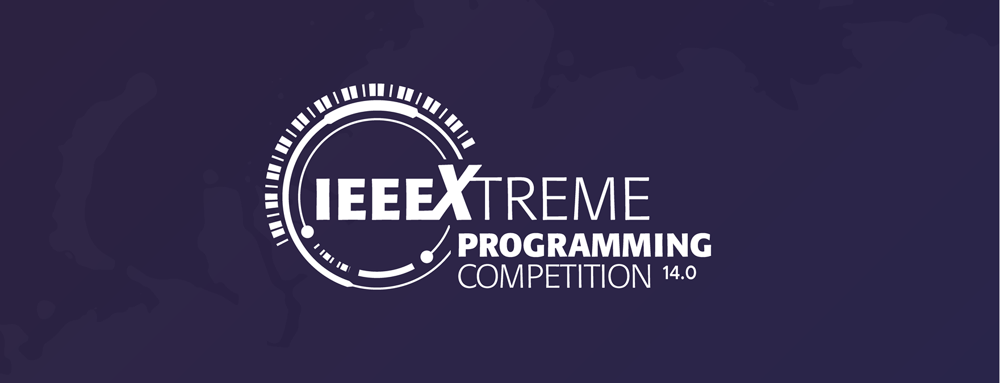

# IEEExtreme14.0

  

  

IEEEXtreme 14.0 Solutions by CaffeineOverflow Team (top 10% worldwide)

# Problems
 - ARM_constant_multiplication (39%)
 - Game of life 2020
 - Hotel Wiring
 - IEEEXplore Indexing (85%)
 - Magical Stones I (86%)
 - Coin Collector
 - Coupon Codes
 - Crafting Wooden Tables
 - Linearly Seperable Samples
 - Non-overlapping Palindromes
 - Rotational Lights

# Ranking 
- Worldwide rank: 168/2155 teams
- Region rank: 45

# Team Members
The team compromised from the following 3 members (in alphabetical order):  
- Emmanouilidis Konstantinos 
- Karypidis Stathis [(github)](https://github.com/Sta8is)
- Makridis Vassilis [(github)](https://github.com/BillMc98)
